<div align="center">
  <a href="https://builder6.com">
    
  </a>

  <h1 align="center">Builder6</h1>

  <p align="center">
    <strong>The AI-Native Cloud Development Platform</strong>
  </p>

  <p align="center">
    <em>Build in the Cloud. Deploy On-Premise. Own Your Code.</em>
  </p>

  <p align="center">
    <a href="LICENSE">
      
    </a>
    <a href="https://github.com/builder6app/builder6.com/actions">
      
    </a>
    <a href="https://builder6.com">
      
    </a>
  </p>
  
  <p align="center">
    <a href="#-introduction">Introduction</a> •
    <a href="#-how-it-works">How It Works</a> •
    <a href="#-key-features">Key Features</a> •
    <a href="#-getting-started">Getting Started</a>
  </p>
</div>

---

## 📖 Introduction

**Builder6** is an open-source, AI-native low-code development environment designed to bridge the gap between rapid cloud prototyping and secure local deployment.

It empowers developers and business users to build enterprise-grade applications (Data Models, UIs, and Logic) entirely in the cloud using **Generative AI** and visual editors.

**The Builder6 Philosophy:**
Unlike traditional SaaS platforms that lock your data into their ecosystem, Builder6 operates on a **"Design Cloud, Run Local"** model. You leverage the power of the cloud for development, but you retain 100% ownership of the final application artifact, which can be exported and hosted on your own infrastructure.

---

## 🔄 How It Works

We combine the collaboration and AI capabilities of a Cloud SaaS with the security of On-Premise hosting.

```mermaid
graph LR
    subgraph Cloud [☁️ Builder6 Cloud IDE]
        A[AI Copilot]
        B[Visual Designer]
        C[Schema Builder]
    end

    Cloud -->|1. Build & Generate| D(📦 Export Package)
    
    subgraph Local [🏢 Your Infrastructure]
        D -->|2. Deploy| E[Runtime Engine]
        E --> F[Your Private Data]
    end
    
    style Cloud fill:#f9f,stroke:#333,stroke-width:2px
    style Local fill:#bbf,stroke:#333,stroke-width:2px

```



1. **Develop (Cloud)**: Use [Builder6.com](https://builder6.com) to design your app. Use AI to instantly generate database schemas and page layouts.
2. **Export (Artifact)**: Download your application as a standard metadata package (JSON/YAML) or a containerized build.
3. **Run (Local)**: Install the package into your local runtime environment. Your production data never touches the Builder6 cloud.

---

## ✨ Key Features

### 🤖 AI-Powered Engineering

* **Prompt-to-App:** Simply describe your business idea (e.g., *"A CRM for a real estate agency"*), and Builder6 generates the entities, fields, and relationships instantly.
* **Generative UI:** Create complex forms, dashboards, and list views using natural language prompts.
* **Logic Assistant:** AI helps write validation rules and business logic scripts.

### 🎨 Visual Studio in the Browser

* **Object Modeler:** An intuitive ERD (Entity Relationship Diagram) designer for managing data structures.
* **Page Builder:** A drag-and-drop UI editor powered by **Amis** and **React**, fully customizable with **Tailwind CSS**.
* **Menu & Navigation:** Visually configure application routing and menu hierarchies.

### 🔓 No Vendor Lock-in

* **Standard Tech Stack:** The generated applications rely on standard open-source technologies (Node.js, MongoDB/PostgreSQL, React).
* **Code Sovereignty:** You own the source code and metadata. You are free to modify, extend, or host it anywhere without a perpetual subscription dependency.

---

## 🏗 Tech Stack

Builder6 is built using a modern, scalable web stack:

*   **Backend Framework**: [NestJS](https://nestjs.com/)
*   **Database**: [MongoDB](https://www.mongodb.com/)
*   **Template Engine**: [LiquidJS](https://liquidjs.com/)
*   **Styling**: [Tailwind CSS](https://tailwindcss.com/)
*   **AI Integration**: OpenAI SDK (compatible with Google Gemini, OpenAI GPT models)

---

## 🚀 Getting Started

### Option 1: Cloud Version (Recommended)

The fastest way to experience Builder6 is to use our hosted service. No installation required.

👉 **[Start Building on Builder6.com](https://builder6.com)**

### Option 2: Local Development (For Contributors)

If you want to contribute to the Builder6 editor source code or run the IDE locally:

1. **Clone the repository**
```bash
git clone [https://github.com/builder6app/builder6.com.git](https://github.com/builder6app/builder6.com.git)
cd builder6.com

```


2. **Install dependencies**
```bash
yarn install

```


3. **Configure Environment**
```bash
cp .env.example .env.local
# Update API keys in .env.local if necessary

```


4. **Start the development server**
```bash
yarn dev

```


5. **Launch**
Open `http://localhost:3000` in your browser.

---

## 🤝 Contributing

We welcome contributions from the community! Whether you are fixing bugs, improving documentation, or submitting new AI prompts.

Please check our [CONTRIBUTING.md](https://www.google.com/search?q=CONTRIBUTING.md) for guidelines.

## 📄 License

This project is licensed under the [MIT License](https://www.google.com/search?q=LICENSE).
